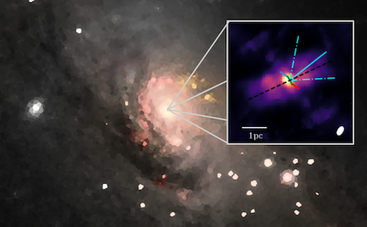

<!-- Make this a component??? -->

# About Me

Hi! I'm Jacob. I'm a Postdoctoral researcher at University of Arizona's Steward Observatory. I am primarily interested in galaxy evolution and the mechanisms that drive it. Specifically, I work to understand the connection between supermassive black holes and their host galaxies. To do this I use interferometers such as the Large Binocular Telescope Interferometer (LBTI) and VLTI/MATISSE to observe the material which feeds the black hole and the winds which impact the host galaxy. 

I am also passionate about education, outreach, and the development of tools (such as games) which can make topics more fun and accessible. 
        
# Research

I completed my PhD at the Max Planck Institute for Astronomy, working with VLTI-MATISSE. The main focus of my thesis was to understand the dusty envelopes of active galactic nuclei (AGN). To do this, we used mid-infrared interferometry to probe the dust at extremely high resolution. Using MATISSE (Multi AperTure mid-Infrared SpectroScopic Experiment) at the VLTI, which combines 4 telescopes, we imaged this circumnuclear dust for the first time, giving an unprecedented glimpse into the "gas tank" which fuels the AGN.

I now work with the Large Binocular Telescope Interferometer (LBTI) team at the University of Arizona to 1. develop and support new observing modes and techniques, and 2. to understand AGN feedback on their hosts using the high-sensitivity, high-resolution Fizeau imaging mode of the LBTI. 

## Active Galactic Nuclei

Active Galactic Nuclei (AGN) are thought to play a major role in regulating star formation in their host galaxies, turning young, blue galaxies with many young stars into red and dead galaxies with primarily old stars and little new star formation. How exactly these powerful "engines" at the centers of galaxies regulate global star formation is not well understood. Moreover, while every galaxy has a supermassive black hole (SMBH) at the center, not every galaxy has an AGN. What exactly triggers an active phase and fuels the AGN? Through studying the dusty regions around AGN, we can better understand how material accretes onto the SMBH to cause an active phase. 

## Interferometry

Even the nearest AGN are appear so small on the sky that traditional telescopes cannot resolve their details. By combining the light from several telescopes, we obtain very high resolution measurements of the material immediately surrounding the AGN. I work to develop new and better ways to turn these measurements into images and to create general data reduction tools for other science cases. Situated at the interface between instrumentation and astrophysics, I get to experiment with new observing setups and science cases. 

# Publications
A complete and always up-to-date list can be found [here](http://adsabs.harvard.edu/cgi-bin/nph-abs_connect?return_req=no_params&author=Isbell,%20Jacob%20W.&db_key=AST)

See my selected works here: [Publications](./Publications/)

## Recent Highlight

### [The dusty heart of Circinus. II. Scrutinizing the LM-band dust morphology using MATISSE](./Publications/the-dusty-heart-circinus-ii.md)
by Isbell, J. W.; Pott, J. -U.; Meisenheimer, K.; Stalevski, M.; Tristram, K. R. W.; Leftley, J.; Asmus, D.; Weigelt, G.; Gámez Rosas, V.; Petrov, R.; Jaffe, W.; Hofmann, K. -H.; Henning, T.; Lopez, B. 

[*Astronomy & Astrophysics, Volume 678, id.A136, 23 pp.*](https://ui.adsabs.harvard.edu/abs/2023A%26A...678A.136I/abstract)

In this paper we present the first-ever L- and M-band interferometric observations of Circinus, building upon a recent N-band analysis. We used these observations to reconstruct images and fit Gaussian models to the L and M bands. Our findings reveal a thin edge-on disk whose width is marginally resolved and is the spectral continuation of the disk imaged in the N band to shorter wavelengths. Additionally, we find a point-like source in the L and M bands that, based on the LMN-band spectral energy distribution fit, corresponds to the N-band point source. We also demonstrate that there is no trace of direct sightlines to hot dust surfaces in the circumnuclear dust structure of Circinus. By assuming the dust is present, we find that obscuration of AV ≳ 250 mag is necessary to reproduce the measured fluxes. Hence, the imaged disk could play the role of the obscuring "torus" in the unified scheme of active galactic nuclei. Furthermore, we explored the parameter space of the disk + hyperbolic cone radiative transfer models and identify a simple modification at the base of the cone. Adding a cluster of clumps just above the disk and inside the base of the hyperbolic cone provides a much better match to the observed temperature distribution in the central aperture. This aligns well with the radiation-driven fountain models that have recently emerged. Only the unique combination of sensitivity and spatial resolution of the VLTI allows such models to be scrutinized and constrained in detail. We plan to test the applicability of this detailed dust structure to other MATISSE-observed active galactic nuclei in the future.

# Outreach and Development

One of the best parts of astronomy is its ability to inspire curiosity in people of all ages. I fundamentally believe in the value of scientific communication, and I work to make science accessible to all. To this end, I have been involved in a number of public talks and presentations. 

Additionally, I helped develop the [Gravbox](https://gravbox.sites.uiowa.edu/), an interactive gravitational dynamics simulation that lets people shape a universe with their own hands. I was fortunate enough to [present this team effort at AAS 231](https://ui.adsabs.harvard.edu/abs/2018AAS...23131606I/abstract). 

During the pandemic, I worked with three other PhD students to develop a platform for interactive, virtual poster sessions. This project was used at numerous virtual conferences, group meetings, and poster competitions. While the project has since become dormant, I am incredibly proud of what we built together and of the connections made within the platform. 
